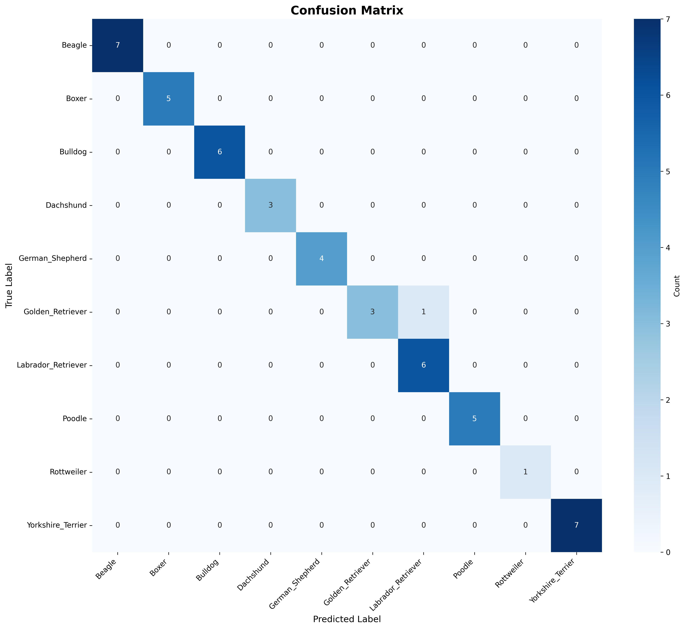

# 🐕 Dog Breed Classification

Phân loại 10 giống chó sử dụng Transfer Learning (EfficientNetB3) với TensorFlow/Keras, kèm công cụ đánh giá, suy luận và web demo bằng Streamlit.


## 📋 Mục lục

- [Giới thiệu](#giới-thiệu)
- [Các giống chó](#các-giống-chó)
- [Cài đặt](#cài-đặt)
- [Hướng dẫn chạy nhanh](#hướng-dẫn-chạy-nhanh)
- [Training & Đánh giá](#training--đánh-giá)
- [Suy luận (Inference)](#suy-luận-inference)
- [Web Demo (Streamlit)](#web-demo-streamlit)
- [Kiến trúc Model](#kiến-trúc-model)
- [Kết quả](#kết-quả)
- [Cấu trúc Project](#cấu-trúc-project)
- [Tùy chỉnh & Cấu hình](#tùy-chỉnh--cấu-hình)
- [Troubleshooting](#troubleshooting)
- [Giấy phép](#giấy-phép)

---

## 🎯 Giới thiệu

Hệ thống nhận diện giống chó từ ảnh với 10 lớp, áp dụng Transfer Learning trên EfficientNetB3. Pipeline gồm: chuẩn bị dữ liệu → huấn luyện → đánh giá → suy luận → export TFLite → demo web.

---

## 🐾 Các giống chó

1. Beagle
2. Boxer
3. Bulldog
4. Dachshund
5. German_Shepherd
6. Golden_Retriever
7. Labrador_Retriever
8. Poodle
9. Rottweiler
10. Yorkshire_Terrier

---

## 🚀 Cài đặt

### Yêu cầu
- Python 3.9
- Khuyến nghị có GPU (CUDA phù hợp với TensorFlow 2.15)

### Cách 1: pip (khuyến nghị)

```bash
# Tạo môi trường ảo
python -m venv venv

# Kích hoạt (Windows PowerShell)
./venv/Scripts/Activate.ps1

# Cài đặt phụ thuộc
pip install -r requirements.txt
```

### Cách 2: conda

```bash
conda env create -f environment.yml
conda activate dog-breed-classification
```

---

## 💻 Hướng dẫn chạy nhanh

### 1) Chuẩn bị dữ liệu
Đặt ảnh vào `data/raw/` theo cấu trúc thư mục mỗi lớp một folder, ví dụ:

```text
data/raw/
├── Beagle/
├── Boxer/
├── ...
└── Yorkshire_Terrier/
```

Chia dữ liệu train/val/test và sao chép vào `data/processed/`:

```bash
python src/data_preparation.py
```

### 2) Train

```bash
python src/train.py
```

Artifacts sẽ nằm tại:
- Model cuối: `models/final/`
- Logs/metrics/plots: `results/`

### 3) Đánh giá trên test set

```bash
python src/evaluate.py --model models/final/best_model_YYYYMMDD_HHMMSS.keras
```

Kết quả sẽ ở `results/metrics/` và `results/plots/`.

---

## 🔮 Suy luận (Inference)

Dự đoán cho một ảnh:

```bash
python src/predict.py --model models/final/dog_breed_classifier_YYYYMMDD_HHMMSS.keras \
  --image data/processed/test/Bulldog/Bulldog_36.jpg --top-k 3
```

Tùy chọn bổ sung:
- `--class-names models/final/class_names.json` nếu muốn chỉ định file lớp.

---

## 🌐 Web Demo (Streamlit)

Chạy ứng dụng web đơn giản:

```bash
streamlit run src/streamlit_app.py
```

Mở trình duyệt tại: `http://localhost:8501` rồi upload ảnh để xem dự đoán.

---

## 🏗️ Kiến trúc Model

- Backbone: EfficientNetB3 (ImageNet, `include_top=False`)
- Input: 300×300×3
- Head: GlobalAveragePooling → Dropout(0.3) → Dense(10, softmax)
- Tối ưu: Adam, `sparse_categorical_crossentropy`, `metrics=['accuracy']`

Tùy chỉnh backbone bằng `BACKBONE` trong `src/config.py` (`efficientnet_b3`, `efficientnet_b4`, `resnet50`).

---

## 📈 Kết quả

Kết quả từ lần huấn luyện gần nhất (trích từ `results/metrics/test_metrics.json` và `models/final/model_info.json`):

| Metric | Score |
|--------|-------|
| Test Accuracy | 97.92% |
| Test Loss | 0.1311 |
| Best Val Accuracy | 97.92% |
| Params (total/trainable) | 10,798,905 / 15,370 |

Per-class accuracy (ví dụ): Beagle 100%, Boxer 100%, Bulldog 100%, Dachshund 100%, German_Shepherd 100%, Golden_Retriever 75%, Labrador_Retriever 100%, Poodle 100%, Rottweiler 100%, Yorkshire_Terrier 100%.



Classification report: xem `results/metrics/classification_report.txt`.

---

## 📁 Cấu trúc Project

```text
dog-breed-classification/
├── data/
│   ├── raw/
│   └── processed/ {train,val,test}/{10 lớp}
├── models/
│   └── final/ *.keras, *.tflite, class_names.json, model_info.json
├── results/
│   ├── logs/
│   ├── metrics/
│   └── plots/
├── src/
│   ├── config.py
│   ├── data_loader.py
│   ├── data_preparation.py
│   ├── model.py
│   ├── train.py
│   ├── evaluate.py
│   ├── predict.py
│   └── streamlit_app.py
├── environment.yml
├── requirements.txt
└── README.md
```

---

## 🔧 Tùy chỉnh & Cấu hình

Chỉnh trong `src/config.py`:
- `BREED_NAMES`: tên lớp
- `IMG_SIZE`, `BATCH_SIZE`, `EPOCHS`, `LEARNING_RATE`, `DROPOUT_RATE`
- `BACKBONE`: chọn kiến trúc
- Tham số callback: EarlyStopping, ReduceLROnPlateau, min LR, v.v.

Tiền xử lý và augmentation trong `src/data_loader.py` (`get_data_augmentation`, `preprocess_image`).

Export TFLite tự động sau train (`utils.export_to_tflite`, có hỗ trợ quantization mặc định Optimize.DEFAULT).

---

## 🛠️ Troubleshooting

- Out of memory (OOM): giảm `BATCH_SIZE` trong `src/config.py` hoặc giảm `IMG_SIZE`.
- Không tìm thấy model: đảm bảo đã train; file `.keras` nằm trong `models/final/`.
- Lỗi load model: thử tham số `compile=False` khi load (đã xử lý trong `predict.py` và `streamlit_app.py`).
- Sai class mapping: dùng `models/final/class_names.json` do `utils.save_class_names` sinh ra sau train.
- GPU không dùng được: kiểm tra bản CUDA/cuDNN tương thích TensorFlow 2.15 hoặc chạy CPU.

---

